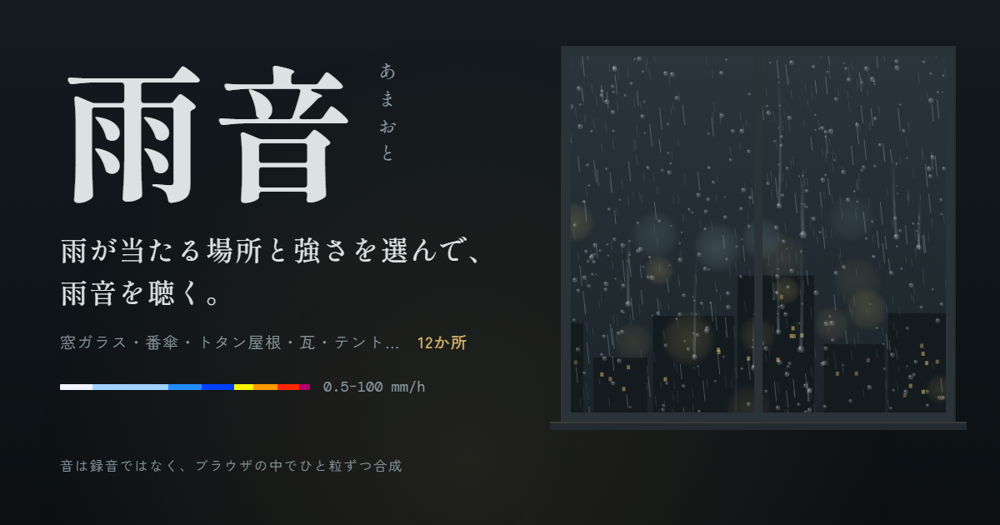

# 雨音（あまおと）

雨が当たる場所と雨の強さを選んで、その雨音を聴くWebアプリです。
音は録音ではなく、ブラウザの中で雨粒ひと粒ずつを合成して鳴らしています。

**▶ アプリを開く：** https://kanameshiga-dev.github.io/amaoto/



## できること

- 雨が当たる場所を 5 つの分類・12 か所から選んで聴く
- 雨の強さを 0.5〜100 mm/h で選ぶ（気象庁の予報用語と、雨雲レーダーの配色に合わせた色帯つき）
- 場所を切り替えると音がなめらかに入れ替わる
- 音量の調整
- おやすみタイマー（15・30・60 分。最後の 1 分で少しずつ小さくなって止まる）
- スマートフォンでもパソコンでも使える。インストールは不要

## 雨が当たる場所

| 分類 | 場所 | 聴く位置 | どんな音か |
|---|---|---|---|
| 傘 | 番傘 | 傘の下 | 油紙が小さな太鼓のように鳴る、低く柔らかい「ぼとぼと」 |
| 傘 | ビニール傘 | 傘の下 | 張ったビニールが鳴る、粒の大きい「ボツボツ」 |
| 傘 | 紳士傘 | 傘の下 | 布地にこもる、落ち着いた「トントン」 |
| 屋根 | トタン屋根 | 室内 | 薄い板が鳴る「ボツボツ」。強い雨では「バラバラ」と部屋を包む |
| 屋根 | 瓦 | 縁側 | 焼き物に当たる乾いた「コツコツ」と、雨樋から落ちる水の音 |
| 屋根 | ガルバリウム | 室内 | 野地板と断熱材越しに、天井の向こうで静かにこもる「サーッ」 |
| 地面 | 土 | 軒下 | 土に吸いこまれる「ぼそぼそ」と、軒先からのしずく |
| 地面 | アスファルト | 軒下 | 硬い路面で跳ねるしぶきの「サーッ」 |
| 家まわり | 窓ガラス | 窓辺 | 風が強まるとパラパラと窓を打ち、外の雨はガラス越しにこもる |
| 家まわり | カーポート | カーポートの下 | ポリカーボネートの波板が頭上で「バラバラ」と鳴る |
| 自然 | テント | テントの中 | 張った布が頭のすぐ上で鳴り、まわりの森の雨が遠くに聞こえる |
| 自然 | 木の葉 | 木の下 | 葉に当たる「サワサワ」と、ときどき落ちる「ボタッ」 |

## 雨の強さ

| mm/h | 呼び方 | 降り方 |
|---|---|---|
| 〜1 | 小雨 | しとしと |
| 1〜3 | 弱い雨 | ぽつぽつ |
| 3〜10 | 本降り | さあさあと切れ目なく降る |
| 10〜20 | やや強い雨 | ザーザーと降る |
| 20〜30 | 強い雨 | どしゃ降り |
| 30〜50 | 激しい雨 | バケツをひっくり返したように降る |
| 50〜80 | 非常に激しい雨 | 滝のように降る |
| 80〜 | 猛烈な雨 | 息苦しくなるような圧迫感がある |

10 mm/h 以上の呼び方と降り方の説明は、気象庁「雨の強さと降り方」にもとづいています。

## しくみ

音声ファイルは使っていません。Web Audio API で次の音を重ねて、その場で合成しています。

- **近くの雨粒：** 場所ごとに作った「ひと粒の音」を何種類か用意し、雨の強さに応じた数だけランダムな間隔・大きさ・左右の位置で鳴らしています
- **遠くの雨粒：** 近くの雨粒よりも小さく、こもらせて鳴らしています
- **雨の地鳴り：** 途切れない「サー」「ザー」という雨の音です。場所ごとにフィルターで音色を変えています
- **風のゆらぎ：** 数秒ごとに雨の量をゆっくり増減させています（窓ガラスは風が強まったときだけ雨が当たります）
- **しずく：** 瓦・土・木の葉では、ときどき落ちるしずくの音を加えています
- **聴く位置：** 室内・縁側などの聴く位置に合わせて、こもり具合と響きを変えています

画面の雨も同じ強さに合わせて降り、場所ごとの情景（傘、屋根、窓、テントなど）を Canvas で描いています。

## ローカルで動かす

`index.html` をブラウザで開くだけで動きます。ビルドや依存パッケージはありません。

```sh
# ローカルサーバーで開く場合
python3 -m http.server 8000
# → http://localhost:8000/
```

ブラウザの仕様により、音は「聴く」ボタンを押してから鳴り始めます。

## ファイル構成

```
index.html   アプリ本体（HTML・CSS・JavaScript をこの1ファイルにまとめています）
og.png       SNS でシェアしたときのプレビュー画像（1200×630）
README.md    このファイル
tools/og.html  og.png の元になる HTML（作り直す手順は CLAUDE.md）
CLAUDE.md    Claude Code 向けの作業メモ
LICENSE      MIT License
```

## クレジット

- 雨の強さの呼び方と降り方の説明：気象庁「雨の強さと降り方」
- 色帯：気象庁の降水強度の配色
- フォント：Shippori Mincho B1、Zen Kaku Gothic New、DM Mono（Google Fonts、SIL Open Font License）

## ライセンス

[MIT License](LICENSE)
